# LLM-Enabled Humanoid Robot

An LLM-driven humanoid robot prototype for vision-guided perception, structured tool calling, and controlled physical interaction.

This project places an LLM-enabled humanoid robot inside a real-world robotic pipeline where it can observe its environment, interpret natural language commands, request actions, and execute validated behaviours such as detecting objects, searching for a target, approaching an object, attempting to pick it up, or returning to a safe position.

The focus of the project is not only the physical humanoid structure itself, but the interface between an intelligent language model, visual perception, robot state, and deterministic control layers.

The system uses a custom **OAX-1B-Humanoid** language model fine-tuned for robot-specific tool use. The model proposes structured JSON tool calls, while a deterministic Planner and Controller validate, repair, reject, or approve those actions before any physical robot movement is executed.

---

## Demo Video

A full demonstration video is available here:

**Watch the demo video:**  
[Google Drive Demo Video](PASTE_YOUR_GOOGLE_DRIVE_LINK_HERE)

The video demonstrates:

- entering a natural language command,
- detecting visible objects through the robot vision system,
- sending structured context to the LLM,
- receiving a JSON-style tool call,
- validating the proposed action through the Planner and Controller,
- executing the action on the humanoid robot,
- updating the robot state after execution.

---

## Demo GIFs

### Example 1: What Do You See?

<p align="center">
  
</p>

This demo shows the robot using its vision system to detect visible objects and generate an object-level response.

---

### Example 2: Find the Bottle

<p align="center">
  
</p>

This demo shows the robot receiving a natural language command, detecting the target object, and executing a search or centring behaviour.

---

### Example 3: Find the Bottle and Pick It Up

<p align="center">
  
</p>

This demo shows a multi-step task where the system detects the target object, validates the generated tool call, moves the arm towards the object, and attempts a physical pick action.

---

## What This Project Does

The robot is designed to connect four main layers:

1. **Perception**  
   The robot observes the environment using a camera-based vision system.

2. **Language Understanding**  
   A user gives a natural language command such as:

   ```text
   Find the bottle.
   ```

3. **LLM Tool Calling**  
   The fine-tuned language model converts the command into a structured robot action.

   ```json
   {
     "tool": "search_object",
     "arguments": {
       "target": "bottle"
     }
   }
   ```

4. **Validated Execution**  
   The Planner and Controller check whether the action is valid, safe, and executable before the robot moves.

Detailed technical explanations are available in the [`docs/`](docs/) folder.

---

## System Architecture

The project follows a modular perception-reasoning-validation-execution pipeline.

<p align="center">
  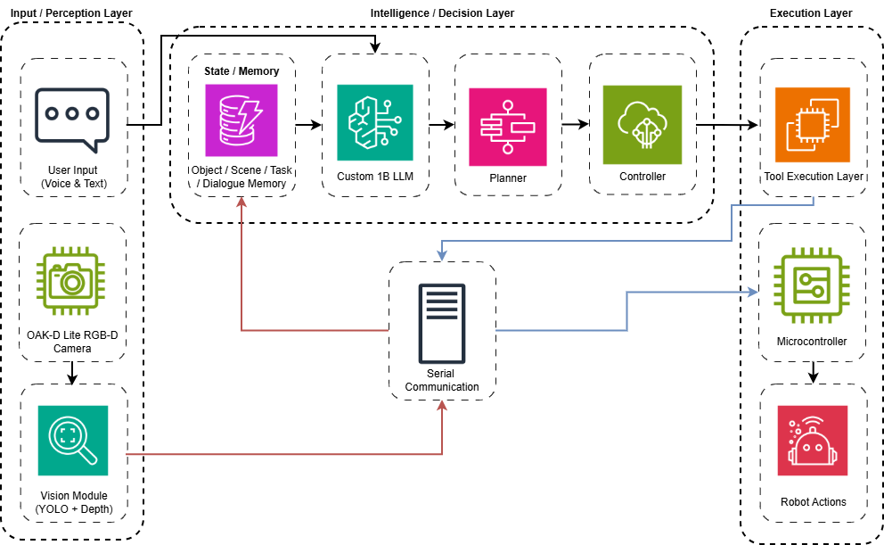
</p>

This diagram shows the integrated perception, reasoning, validation, memory, serial communication, and execution layers of the humanoid robot system.

```text
User Command
     |
     v
Voice / Text Input
     |
     v
Vision System + Robot State
     |
     v
LLM Reasoning Layer
     |
     v
JSON Tool Call
     |
     v
Planner
     |
     v
Controller
     |
     v
Motion Control
     |
     v
Arduino / Actuators
     |
     v
Robot State Update
```

The LLM does not directly control the robot motors. Instead, it acts as a high-level reasoning layer that proposes structured actions.

The physical execution is handled only after deterministic validation.

For more details, see [`docs/system_overview.md`](docs/system_overview.md).

---

## Robot Design

### Overall Humanoid Design

<p align="center">
  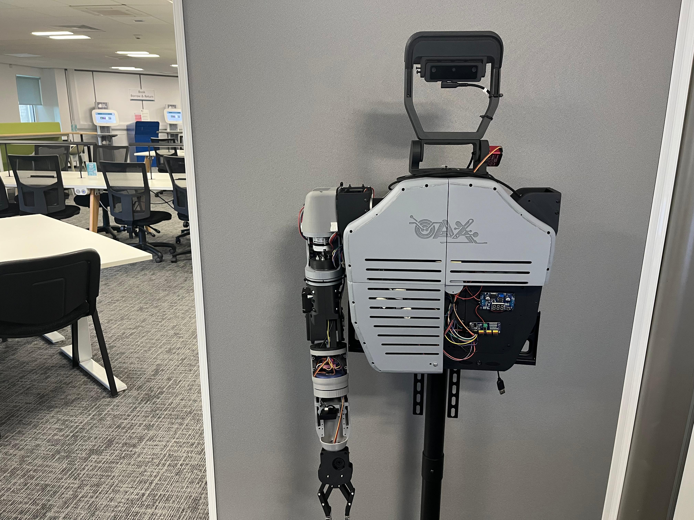
</p>

This figure shows the physical prototype of the developed humanoid robot system, including the fixed-base upper-body structure, head mechanism, robotic arm, and main body layout.

<p align="center">
  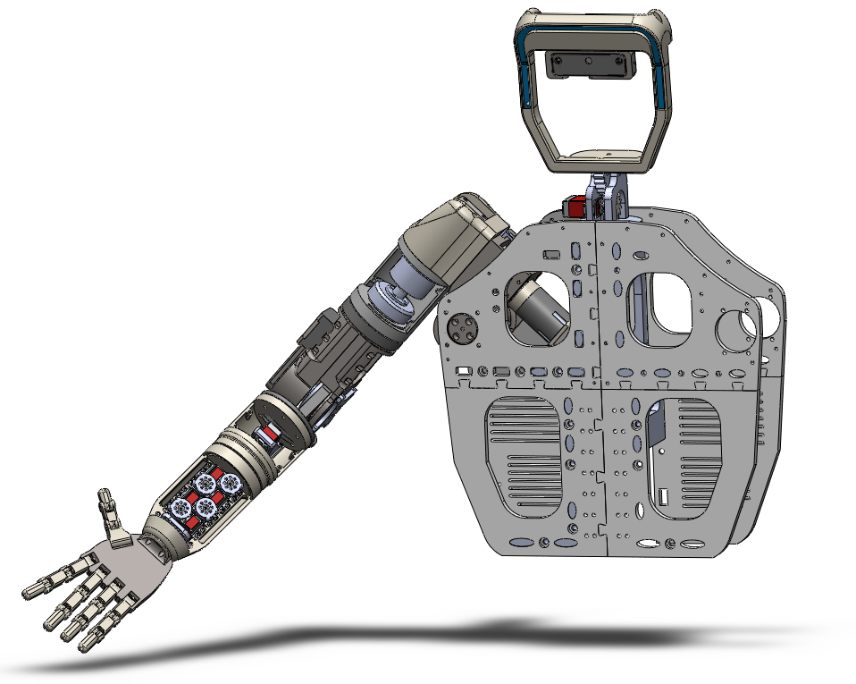
</p>

This figure shows the 3D design of the humanoid robot prototype before full physical assembly.

The prototype was designed as a fixed-base humanoid upper-body system. This structure was selected to keep the system mechanically feasible while focusing on perception, reasoning, validation, and upper-body manipulation.

---

### Robotic Arm Structure

<p align="center">
  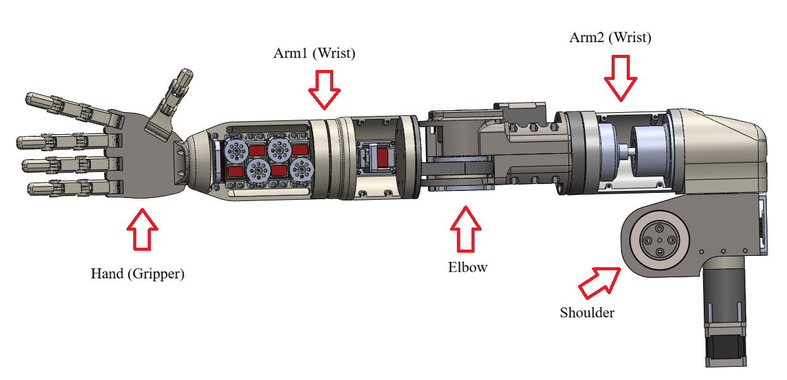
</p>

This figure shows the mechanical structure of the robotic arm, including the shoulder, elbow, wrist joints, and end-effector/gripper. The arm was designed as a 5-DOF structure for object reaching, positioning, basic manipulation, and human-robot interaction tasks.

Main arm functions include:

- shoulder movement for positioning,
- elbow movement for reach control,
- wrist/end-effector alignment,
- gripper opening and closing,
- object approach and basic grasping attempts.

---

### Gripper / End-Effector Design

<p align="center">
  
</p>

The end-effector is designed as a simplified parallel gripper. A more complex multi-finger gripper concept was initially considered, but a parallel gripper was preferred to reduce mechanical complexity, actuator requirements, calibration effort, and control difficulty.

The final parallel gripper design supports:

- basic object grasping,
- pick attempts,
- placing tasks,
- handover-style interactions.

---

### Head and Pan-Tilt Mechanism

<p align="center">
  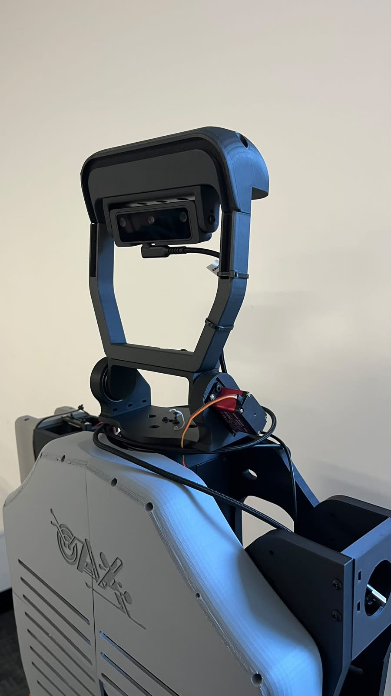
</p>

This figure shows the robot head mechanism integrated into the physical prototype.

<p align="center">
  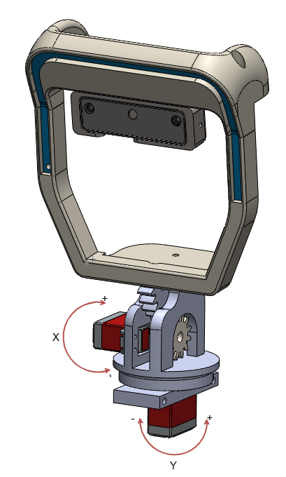
</p>

This figure shows the 2-DOF pan-tilt head design used for active camera movement.

The pan-tilt mechanism supports:

- horizontal camera movement,
- vertical camera movement,
- active object search,
- object centring,
- visual interaction with the environment.

---

## Hardware Integration

<p align="center">
  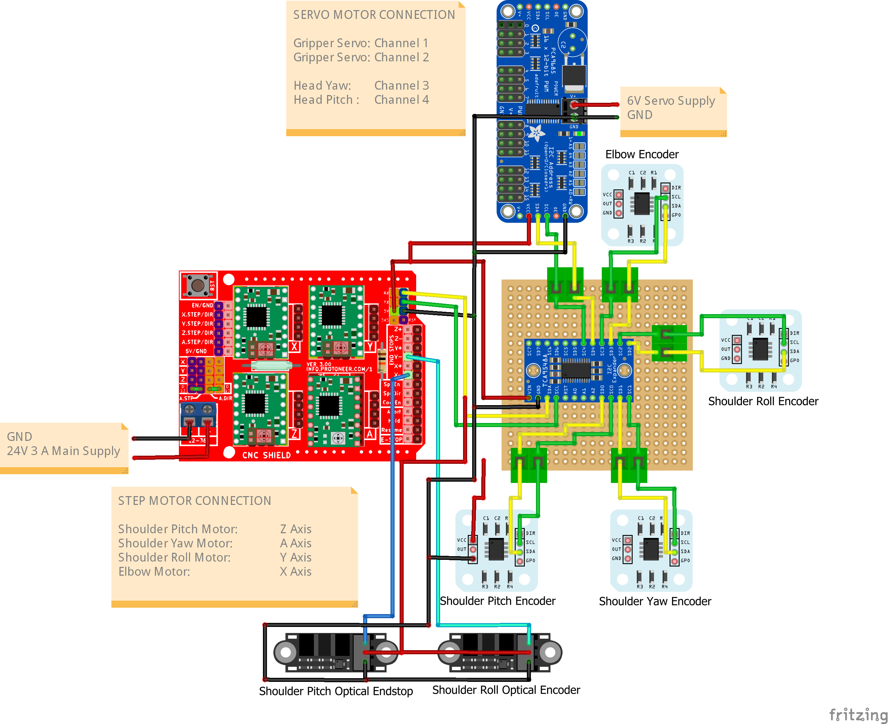
</p>

This diagram shows the main hardware integration structure of the humanoid robot system, including sensing, control, actuation, and power distribution components.

The physical prototype includes:

- fixed-base humanoid upper-body structure,
- 5-DOF robotic arm,
- parallel gripper,
- 2-DOF pan-tilt head,
- OAK-D Lite RGB-D camera,
- Arduino-based low-level controller,
- stepper motors,
- servo motors,
- encoders,
- 3D-printed mechanical parts,
- external power distribution for motors and electronics.

The fixed-base design was selected to reduce cost, mechanical complexity, locomotion requirements, and safety risks while keeping the focus on perception, reasoning, validation, and upper-body manipulation.

---

## Physical Prototype and Task Execution

The physical prototype was tested in object search, object approach, and pick attempt scenarios under controlled indoor conditions.

The tests focused on whether the robot could:

- detect objects,
- select a target object,
- generate structured tool calls,
- validate actions before execution,
- move the arm towards a target,
- attempt basic grasping,
- update the robot state after execution.

Full evaluation details are available in [`results/`](results/).

---

## Key Features

- LLM-enabled humanoid robot control pipeline
- Custom **OAX-1B-Humanoid** model for robot-specific tool use
- JSON-based tool calling
- Planner and Controller validation layers
- Camera-based object perception
- Object search and target selection
- Robot state and memory representation
- 5-DOF robotic arm
- Parallel gripper
- 2-DOF pan-tilt head mechanism
- OAK-D Lite camera integration
- Arduino-based low-level control
- IK/FK-supported motion planning
- Physical object approach and pick attempts
- Safety-aware action validation before execution

---

## Additional Documentation

More detailed documentation and example files are available in the repository:

- [`examples/`](examples/) — example action schemas, sample LLM outputs, robot state examples, and task flows.
- [`docs/`](docs/) — technical documentation for the system overview, LLM tool calling, Planner/Controller validation, vision system, motion control, and future work.
- [`results/`](results/) — evaluation summary with perception, LLM, validation, motion planning, and physical execution results.

---

## Supported Tools

The LLM can generate structured tool calls such as:

```text
get_visible_objects
search_object
track_object
pick_object
place_object
handover_object
go_home
stop_action
get_robot_status
```

Example:

```json
{
  "tool": "get_visible_objects",
  "arguments": {}
}
```

Example:

```json
{
  "tool": "pick_object",
  "arguments": {
    "target": "bottle"
  }
}
```

For the full example schema, see [`examples/action_schema.json`](examples/action_schema.json).

For sample LLM outputs, see [`examples/sample_llm_outputs.json`](examples/sample_llm_outputs.json).

---

## Planner and Controller

<p align="center">
  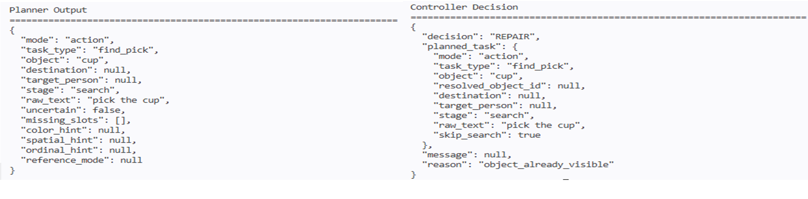
</p>

This figure shows an example Planner output and Controller decision after processing a raw LLM-generated action. The Planner converts the model output into a structured task representation, while the Controller checks whether the proposed action is valid, safe, and executable before allowing physical execution.

The Planner and Controller are used to prevent unsafe or invalid LLM outputs from reaching the robot.

They check for:

- invalid tool names,
- missing arguments,
- unsupported actions,
- ambiguous object references,
- target objects that are not visible,
- robot state conflicts,
- unsafe requests,
- failed or incomplete actions.

For example, if the LLM generates a `pick_object` action but the target object is not visible, the Controller can reject the action or request a `search_object` action first.

This makes the system more reliable than directly sending LLM outputs to the robot.

For more details, see [`docs/planner_controller.md`](docs/planner_controller.md).

---

## Software Overview

The software side is built around a modular Python-based pipeline.

Main modules:

```text
vision module
voice/text input module
state and memory module
LLM inference module
planner module
controller module
motion control module
serial communication layer
robot execution layer
```

The system combines visual context, user commands, and robot state before generating an action.

For a more detailed system explanation, see [`docs/system_overview.md`](docs/system_overview.md).

---

## Vision System

### Sample Object Detections

<p align="center">
  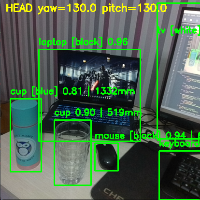
</p>

This figure shows sample object detections obtained from the robot vision system.

The vision system provides object-level context for the robot.

It is used for:

- detecting visible objects,
- identifying target objects,
- estimating approximate object position,
- supporting object search,
- updating the robot state,
- providing context to the LLM.

Example perception output:

```json
{
  "visible_objects": ["bottle", "cup", "laptop"],
  "target": "bottle",
  "status": "visible"
}
```

---

### Perception Data in Robot Memory

<p align="center">
  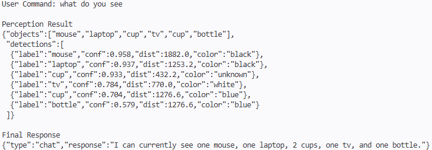
</p>

This figure shows how detected objects are converted into structured perception data and integrated into the robot state/memory layer.

The visual context is combined with the user command and robot state before being passed into the reasoning layer.

For more details, see [`docs/vision_system.md`](docs/vision_system.md).

---

## LLM Reasoning Layer

The LLM reasoning layer receives the user command, visible objects, robot state, and task context.

Instead of producing low-level motor commands, the model produces structured JSON-style tool calls. This keeps the system interpretable, easier to debug, and safer to validate before physical execution.

Example input context:

```json
{
  "user_command": "Find the bottle.",
  "visible_objects": ["cup", "bottle", "laptop"],
  "robot_state": {
    "holding_object": false,
    "current_action": "idle",
    "arm_position": "home"
  }
}
```

Example model output:

```json
{
  "tool": "search_object",
  "arguments": {
    "target": "bottle"
  }
}
```

For more details, see [`docs/llm_tool_calling.md`](docs/llm_tool_calling.md).

---

## State and Memory

The State/Memory layer stores information about the robot and the environment.

It may include:

- visible objects,
- selected target object,
- current robot action,
- gripper status,
- whether the robot is holding an object,
- previous action result,
- failure or retry status,
- robot arm position,
- task progress.

Example robot state:

```json
{
  "visible_objects": ["bottle", "cup"],
  "target_object": "bottle",
  "holding_object": false,
  "gripper_status": "open",
  "current_action": "search_object",
  "last_result": "target_visible"
}
```

This state is used by the Controller to decide whether an action is valid or should be rejected, repaired, or delayed.

For a full sample robot state, see [`examples/sample_robot_state.json`](examples/sample_robot_state.json).

---

## Kinematics and Motion Control

### Spatial Mapping and IK Target Estimation

<p align="center">
  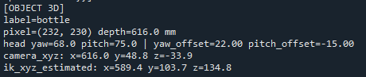
</p>

This figure shows how a detected object is converted from pixel position, depth information, and head pose into estimated IK target coordinates for the robotic arm.

The robotic arm uses IK/FK-supported motion planning to convert target positions into joint-level movement commands.

The motion control layer is responsible for:

- joint movement execution,
- predefined robot poses,
- object approach behaviour,
- gripper opening and closing,
- returning to a safe home position,
- sending validated commands to the low-level controller.

The system uses deterministic control logic after the LLM output has been validated. This ensures that the final movement is not directly generated by the language model.

### IK/FK Solver Output

<p align="center">
  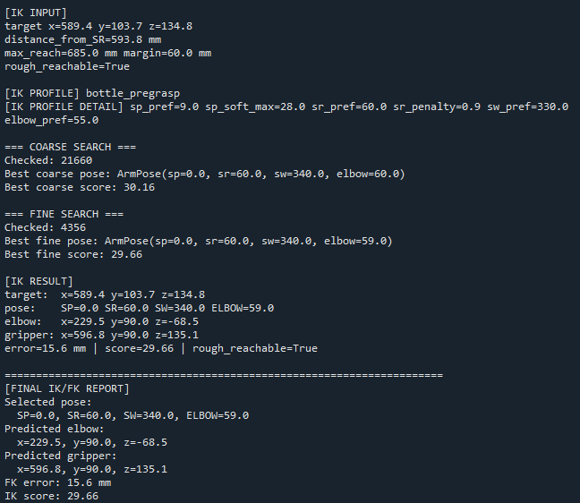
</p>

This figure shows an example IK/FK solver output for a detected target. The solver receives an estimated target position, checks reachability, performs coarse and fine pose search, selects a candidate arm pose, and reports the final FK error.

For more details, see [`docs/kinematics_motion_control.md`](docs/kinematics_motion_control.md).

---

## Example Commands

The system is designed to handle commands such as:

```text
What do you see?
Find the bottle.
Track the bottle.
Pick up the bottle.
Place the object.
Give me the object.
Go home.
Stop.
```

Example action flow:

```text
User command:
Find the bottle and pick it up.

System flow:
1. Get visible objects
2. Search for the bottle
3. Estimate the target position
4. Generate a pick_object tool call
5. Validate the tool call
6. Move the arm towards the target
7. Attempt grasping
8. Update the robot state
```

For more example flows, see [`examples/example_task_flows.md`](examples/example_task_flows.md).

---

## Example Task: What Do You See?

```text
User:
What do you see?
```

Expected behaviour:

```text
1. Capture camera frame
2. Run object detection
3. Update visible objects
4. Generate a response
```

Example response:

```text
I can see a bottle, a cup, and a laptop.
```

---

## Example Task: Find the Bottle

```text
User:
Find the bottle.
```

Expected tool call:

```json
{
  "tool": "search_object",
  "arguments": {
    "target": "bottle"
  }
}
```

Expected behaviour:

```text
1. Check visible objects
2. Search for the target object
3. Centre or approach the detected object
4. Update the robot state
```

---

## Example Task: Find the Bottle and Pick It Up

```text
User:
Find the bottle and pick it up.
```

Expected action sequence:

```json
[
  {
    "tool": "get_visible_objects",
    "arguments": {}
  },
  {
    "tool": "search_object",
    "arguments": {
      "target": "bottle"
    }
  },
  {
    "tool": "pick_object",
    "arguments": {
      "target": "bottle"
    }
  },
  {
    "tool": "get_robot_status",
    "arguments": {}
  }
]
```

Expected behaviour:

```text
1. Detect visible objects
2. Search for the bottle
3. Estimate the target position
4. Validate the pick action
5. Move the arm towards the target
6. Attempt grasping
7. Update the robot state
```

More examples are available in [`examples/`](examples/).

---

## Action Validation Example

A raw LLM output is not executed immediately.

Example invalid situation:

```json
{
  "tool": "pick_object",
  "arguments": {
    "target": "bottle"
  }
}
```

If the bottle is not currently visible, the Controller can reject or repair the action.

Possible Controller decision:

```json
{
  "decision": "repair",
  "reason": "Target object is not visible. Search is required before pick.",
  "repaired_action": {
    "tool": "search_object",
    "arguments": {
      "target": "bottle"
    }
  }
}
```

This prevents the robot from attempting unsafe or impossible actions.

For a more detailed explanation, see [`docs/planner_controller.md`](docs/planner_controller.md).

---

## Evaluation

The project was evaluated across different system stages:

```text
vision system
LLM output generation
JSON tool-call validity
Planner validation
Controller validation
IK/FK motion planning
physical pick attempts
failure handling
```

The evaluation focused on whether the system could:

- understand user commands,
- generate correct tool calls,
- avoid unsafe direct execution,
- validate or repair invalid actions,
- use visual context during decision-making,
- execute basic physical behaviours,
- handle failure cases safely.

The results showed that the perception and LLM tool-calling pipeline worked effectively for structured robot commands. However, physical manipulation remained the most difficult part of the system due to mechanical tolerances, limited arm degrees of freedom, gripper alignment, and object height variation.

Full evaluation results are available in [`results/`](results/).

---

## Current Results

Current project status includes:

- functional humanoid upper-body prototype,
- integrated camera-based perception pipeline,
- structured LLM tool-call generation,
- Planner and Controller validation logic,
- robot state and memory representation,
- IK/FK-supported motion planning tests,
- basic object search behaviour,
- physical object approach attempts,
- physical pick attempts under controlled conditions.

The system demonstrates that an LLM can be used as a high-level reasoning layer in a robotic pipeline when its outputs are constrained, structured, and validated before execution.

Detailed evaluation metrics are available in [`results/`](results/).

---

## Limitations

Current limitations include:

- limited 5-DOF arm flexibility,
- fixed-base structure,
- limited approach angles,
- gripper alignment sensitivity,
- mechanical tolerance from 3D-printed parts,
- object height variation during grasping,
- limited physical pick reliability,
- LLM latency during real-time interaction,
- controlled indoor testing environment.

Physical manipulation is currently less reliable than the perception and reasoning pipeline. This is mainly due to the mechanical limitations of the prototype rather than the tool-calling architecture itself.

For more details, see [`docs/limitations_future_work.md`](docs/limitations_future_work.md).

---

## Future Work

Planned improvements include:

- ROS2-based modular implementation,
- URDF/Gazebo or PyBullet simulation,
- improved wrist-camera alignment,
- better camera-to-robot calibration,
- improved gripper design,
- higher-DOF arm design,
- closed-loop visual servoing,
- more robust grasp detection,
- expanded robot-specific tool-use dataset,
- improved latency and inference optimisation,
- quantitative benchmarking of task success rate.

For more details, see [`docs/limitations_future_work.md`](docs/limitations_future_work.md).

---

## Repository Structure

```text
llm-enabled-humanoid-robot/
│
├── README.md
│
├── media/
│   ├── hardware_integration.png
│   ├── ik_fk_solver_output.png
│   ├── oax_robot_gripper.jpg
│   ├── oax_robot_head.png
│   ├── oax_robot_head2.png
│   ├── overall_robot_design.png
│   ├── overall_robot_design2.png
│   ├── perception_memory_output.png
│   ├── planner_controller_decision.png
│   ├── robotic_arm_structure.png
│   ├── spatial_mapping_ik_target.png
│   ├── system_architecture.png
│   ├── vision_detections.png
│   │
│   └── demos/
│       ├── what_do_you_see.gif
│       ├── find_the_bottle.gif
│       └── find_and_pick_bottle.gif
│
├── examples/
│   ├── README.md
│   ├── action_schema.json
│   ├── sample_llm_outputs.json
│   ├── sample_robot_state.json
│   └── example_task_flows.md
│
├── docs/
│   ├── README.md
│   ├── system_overview.md
│   ├── llm_tool_calling.md
│   ├── planner_controller.md
│   ├── vision_system.md
│   ├── kinematics_motion_control.md
│   └── limitations_future_work.md
│
└── results/
    └── README.md
```

---

## Source Code Availability

This repository is intended as a public project showcase for portfolio, academic, and recruitment purposes.

The full implementation code is not publicly released because the project includes hardware-specific control logic, robot execution modules, custom prompts, and dissertation-related development files.

This repository provides:

- system overview,
- architecture explanation,
- robot design visuals,
- hardware description,
- software pipeline,
- example tool calls,
- example task flows,
- evaluation summary,
- demo media,
- limitations and future work.

---

## Project Status

```text
Prototype developed
Vision system integrated
LLM tool-calling pipeline implemented
Planner and Controller validation implemented
Robot motion pipeline tested
Physical pick attempts evaluated
Further work planned for ROS2, simulation, and manipulation reliability
```

---

## Author

**Orhan Aydin**  
Mechatronics Engineer | MSc Data Science and Artificial Intelligence  
Bournemouth, United Kingdom  

GitHub: [github.com/orhanaydinn](https://github.com/orhanaydinn)  
LinkedIn: [linkedin.com/in/orhan-aydin](https://linkedin.com/in/orhan-aydin/)
